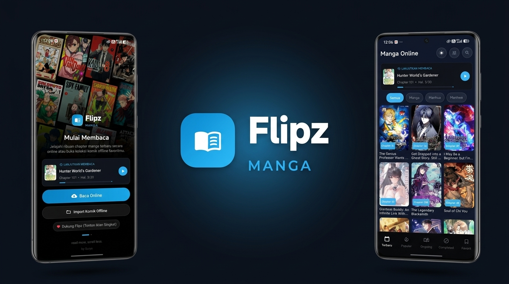

# 📖 Flipz Manga

**A Modern Comic, Manhwa, and Manga Reader Built with Native Android & Jetpack Compose**

---

## 🌟 About Flipz Manga

**Flipz Manga** is a next-generation Android comic and manga reader app built from the ground up with **Kotlin & Jetpack Compose**. Designed for passionate manga, manhwa, and comic enthusiasts, Flipz Manga delivers an ultra-smooth, customizable, and immersive reading experience for both online streaming and offline reading.

Featuring a sleek modern dark UI, advanced reader controls, a smart dynamic magnifier loupe, rapid pagination catalog scraping, automatic Cloudflare solver, and background chapter release notifications.

---

## ⚡ Key Features

### 📖 1. Interactive & Immersive Reader
- **Smooth Reading Experience**: Supports seamless vertical webtoon scrolling and fast page-turning navigation.
- **Stabilized Quick Slider**: Jitter-free bottom page scrubber with a clean, pinned page indicator badge (`Page X/Y`).
- **Dynamic Magnifier Loupe**: Rounded-corner rectangular zoom loupe with a dedicated floating indicator pill and instant exit button.
- **Audio & Haptic Feedback**: Realistic page-turn sound effects and tactile vibrations for physical comic feel.
- **Aesthetic Overlays**: Subtle paper texture and book spine shadow layers.

### 🌐 2. Online Catalog & Rapid Scraping
- **Extensive Library**: Instant access to thousands of manga, manhwa, and manhua titles.
- **Deep Genre Filtering**: Explore titles across dozens of genres with infinite catalog pagination.
- **Auto Cloudflare Solver**: Built-in OkHttp Cloudflare interceptor and fallback in-app web solver for seamless scraping.

### 💾 3. Offline Reading & Data Management
- **Offline Chapter Downloads**: Download your favorite chapters directly to local storage to read anywhere without internet.
- **Continue Reading**: Auto-saves your exact reading progress and recent chapters using Room Database.
- **Backup & Restore**: Easily export and import your saved bookmarks and favorites via JSON format.

### 🔍 4. On-Device Translation
- **AI / ML Kit Translation**: Built-in on-device optical character recognition (OCR) and text translation overlay for foreign manga panels.

### 🔔 5. New Chapter Alerts
- **Background Worker**: Powered by AndroidX `WorkManager` to periodically check for newly released chapters in the background and notify you instantly.

---

## 📥 Download Latest APK

Download and install the latest APK build directly from GitHub Releases:

| Variant | Size | Description | Download Link |
| :--- | :--- | :--- | :--- |
| **Universal Release** | ~52 MB | Compatible with all Android smartphones and tablets | [Download Universal APK](https://github.com/suryana140802-oss/flipz-manga-app/releases/download/v2.1.0/FlipzManga-v2.1-Universal.apk) |
| **arm64-v8a Release** | ~34 MB | Optimized specifically for modern 64-bit devices | [Download arm64 APK](https://github.com/suryana140802-oss/flipz-manga-app/releases/download/v2.1.0/FlipzManga-v2.1-arm64.apk) |

> Visit the [GitHub Releases Page](https://github.com/suryana140802-oss/flipz-manga-app/releases) for detailed release notes and version history.

---

## 🛠️ Architecture & Tech Stack

- **Language**: [Kotlin](https://kotlinlang.org/)
- **UI Framework**: [Jetpack Compose (Material 3)](https://developer.android.com/jetpack/compose)
- **Concurrency**: Kotlin Coroutines & StateFlow
- **Local Storage**: [Room Database](https://developer.android.com/training/data-storage/room) & DataStore
- **Networking & Scraping**: [OkHttp3](https://square.github.io/okhttp/) & [Jsoup](https://jsoup.org/)
- **Image Loading**: [Coil Compose](https://coil-kt.github.io/coil/compose/)
- **Background Tasks**: [AndroidX WorkManager](https://developer.android.com/topic/libraries/architecture/workmanager)
- **Machine Learning**: Google ML Kit On-Device Translation
